# 🏛️ Staking Protocol

一个基于 **Solidity + Go** 构建的生产级 Web3 质押协议。

**核心特性：**

- ⚡ **Solidity 智能合约** — ERC20 质押 + 线性奖励分发，16 个 Foundry 测试全通过
- 🔧 **Go 后端三服务** — API + Indexer + Consumer
- 📡 **链上事件索引** — Polling + Cursor 断点续传 + 事务捆绑
- 🔄 **双层持久化** — MySQL + RabbitMQ（Redis 缓存规划中）
- 🐳 **Docker 一键部署** — 多阶段构建 + 5 容器编排（MySQL + RabbitMQ + API + Indexer + Consumer）
- ✅ **完整测试体系** — DAO / API / MQ / Benchmark / E2E 全通过

[](https://go.dev/)
[](https://soliditylang.org/)
[](https://book.getfoundry.sh/)
[](https://www.mysql.com/)
[](https://www.rabbitmq.com/)
[](https://www.docker.com/)

---

## 📋 目录

- [系统架构](#-系统架构)
- [技术栈](#-技术栈)
- [项目结构](#-项目结构)
- [智能合约](#-智能合约)
- [快速启动](#-快速启动)
- [API 接口](#-api-接口)
- [测试](#-测试)
- [踩坑记录](#-踩坑记录)
- [后续规划](#-后续规划)

---

## 📐 系统架构

```text
┌─────────────────────────────────────────────────────────────────────────────┐
│ 区块链（Ethereum / Anvil）                                                  │
│ ┌───────────────────────────────────────────────────────────────────────┐ │
│ │ Staking.sol（ERC20 质押 + 线性奖励）                                  │ │
│ │ ├── stake(uint256) → Staked event                                     │ │
│ │ ├── withdraw(uint256) → Withdrawn event                               │ │
│ │ └── claimReward() → RewardPaid event                                  │ │
│ └───────────────────────────────────────────────────────────────────────┘ │
└─────────────────────────────────────────────────────────────────────────────┘
│
│ Event Logs
▼
┌─────────────────────────────────────────────────────────────────────────────┐
│ Indexer 服务（offchain/cmd/indexer + internal/indexer）                     │
│ ├── ① Polling 轮询链上新区块（3 秒间隔）                                    │
│ ├── ② FilterLogs 过滤目标合约事件                                           │
│ ├── ③ 按 Event Signature 解析事件数据                                       │
│ ├── ④ Cursor（last_block）断点续传                                          │
│ └── ⑤ 投递消息到 RabbitMQ                                                   │
└─────────────────────────────────────────────────────────────────────────────┘
│
│ 生产者（Producer）
▼
┌─────────────────────────────────────────────────────────────────────────────┐
│ 消息队列（RabbitMQ）                                                        │
│ ├── 解耦同步任务和 API 请求                                                 │
│ ├── 同步失败不影响用户交易                                                  │
│ └── 消费者确认 + 重试机制                                                   │
└─────────────────────────────────────────────────────────────────────────────┘
│
│ MQ Consumer
▼
┌─────────────────────────────────────────────────────────────────────────────┐
│ Consumer 服务（offchain/cmd/consumer + internal/mq）                        │
│ ├── ① 消费消息                                                              │
│ ├── ② 去重表插入 (tx_hash, log_index)                                       │
│ ├── ③ 业务表写入（stakes / reward_claims）                                  │
│ └── ④ 手动 ACK                                                              │
└─────────────────────────────────────────────────────────────────────────────┘
│
▼
┌─────────────────────────────────────────────────────────────────────────────┐
│ DAO 层（offchain/internal/dao）                                             │
│ ├── stake_dao.go → stakes 表                                                │
│ ├── claim_dao.go → reward_claims 表                                         │
│ ├── cursor_dao.go → sync_cursor 表                                          │
│ └── event_log_dao.go → event_log 表（去重）                                 │
└─────────────────────────────────────────────────────────────────────────────┘
│
▼
┌─────────────────────────────────────────────────────────────────────────────┐
│ MySQL 数据库                                                                │
│ ├── stakes → 用户质押记录                                                   │
│ ├── reward_claims → 领取历史                                                │
│ ├── sync_cursor → 同步进度（last_block）                                    │
│ └── event_log → 去重表（(tx_hash, log_index) UNIQUE）                       │
└─────────────────────────────────────────────────────────────────────────────┘
│
▼
┌─────────────────────────────────────────────────────────────────────────────┐
│ API 服务（offchain/cmd/api + internal/api）                                 │
│ ├── REST 接口：查询 / 交易                                                  │
│ ├── 健康检查 /health                                                        │
│ └── 响应 DTO 定义（internal/api/dto）                                       │
└─────────────────────────────────────────────────────────────────────────────┘
│
▼
User / Client
```

---

## 🛠️ 技术栈

| 层级 | 技术 |
| :--- | :--- |
| **区块链** | Solidity 0.8.x, Foundry, OpenZeppelin |
| **后端** | Go 1.25, Gin, GORM |
| **数据库** | MySQL 8.0 |
| **消息队列** | RabbitMQ 3.x |
| **Ethereum** | go-ethereum, RPC, 事件索引, ABI 绑定 |
| **日志** | log/slog（JSON 结构化） |
| **容器化** | Docker + Docker Compose |
| **依赖管理** | Go Modules, Git Submodule |

---

## 📁 项目结构

```text
staking-protocol/
├── onchain/                # Solidity 合约
│   ├── src/
│   │   ├── Staking.sol     # 质押合约（16 个测试）
│   │   └── mocks/MockERC20.sol # 测试用 ERC20
│   ├── test/Staking.t.sol  # Foundry 测试
│   ├── script/DeployStaking.s.sol # 部署脚本
│   ├── lib/                # 依赖（git submodule）
│   └── foundry.toml
│
├── offchain/               # Go 后端
│   ├── cmd/
│   │   ├── api/main.go     # API 服务入口
│   │   ├── indexer/main.go # Indexer 入口
│   │   └── consumer/main.go # MQ 消费者入口
│   │
│   ├── internal/
│   │   ├── api/
│   │   │   ├── handler/    # HTTP Handler
│   │   │   ├── service/    # 业务逻辑
│   │   │   └── dto/        # 请求/响应 DTO
│   │   ├── dao/            # DAO 层（数据访问）
│   │   │   ├── db.go       # 连接初始化 + AutoMigrate
│   │   │   ├── models.go   # 4 张表定义
│   │   │   ├── stake_dao.go
│   │   │   ├── claim_dao.go
│   │   │   ├── cursor_dao.go
│   │   │   ├── event_log_dao.go
│   │   │   ├── dao_test.go # 5 个单元测试
│   │   │   └── benchmark_test.go # 5 个 benchmark
│   │   ├── indexer/
│   │   │   └── listener.go # 链上事件监听（Polling）
│   │   ├── mq/
│   │   │   ├── message.go  # EventMessage 结构
│   │   │   ├── producer.go # 生产者（Indexer 投递）
│   │   │   ├── consumer.go # 消费者（写 DAO）
│   │   │   └── mq_test.go  # 4 个集成测试
│   │   ├── contract/
│   │   │   └── staking.go  # ABI 绑定
│   │   ├── config/config.go # 配置加载
│   │   └── infra/eth/client.go # 链节点连接
│   │
│   ├── abi/Staking.json    # 合约 ABI
│   ├── test/
│   │   ├── e2e_test.sh     # E2E 测试
│   │   └── run_all_tests.sh # 一键全部测试
│   │
│   ├── Dockerfile          # 多阶段构建
│   ├── .dockerignore
│   ├── .env.example        # 配置模板（进 Git）
│   └── go.mod
│
├── docker-compose.yml      # 5 容器编排
├── build.sh                # 构建脚本（自动获取局域网 IP）
├── images/                 # 21 张测试截图
└── README.md
```

---

## 📄 智能合约

**文件：** `onchain/src/Staking.sol`

基于 OpenZeppelin 标准实现，包含：

- ✅ ERC20 代币质押
- ✅ 线性奖励分发
- ✅ 用户奖励记账
- ✅ 事件日志推送
- ✅ 安全机制（SafeERC20 + Ownable + ReentrancyGuard）

**核心功能：**

| 功能 | 说明 |
| :--- | :--- |
| `stake(uint256)` | 质押 ERC20 代币 |
| `withdraw(uint256)` | 提取已质押代币 |
| `claimReward()` | 领取累积奖励 |
| `getUserInfo(address)` | 查询用户质押和奖励 |
| `setRewardRate(uint256)` | 更新奖励速率（仅管理员） |
| `emergencyWithdrawReward(uint256)` | 紧急提取奖励代币（仅管理员） |

**合约事件：**

```solidity
event Staked(address indexed user, uint256 amount);
event Withdrawn(address indexed user, uint256 amount);
event RewardPaid(address indexed user, uint256 reward);
event RewardRateUpdated(uint256 newRate);
```

### 合约测试（Foundry）

```bash
cd onchain
forge test --gas-report
```

**结果：** 16 passed; 0 failed; 0 skipped

### 测试覆盖率

```bash
forge coverage
```

**结果：** Staking.sol 93.75% 行覆盖率

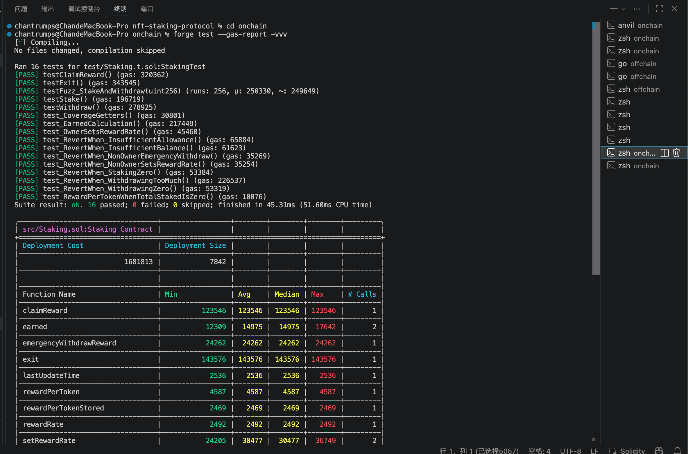
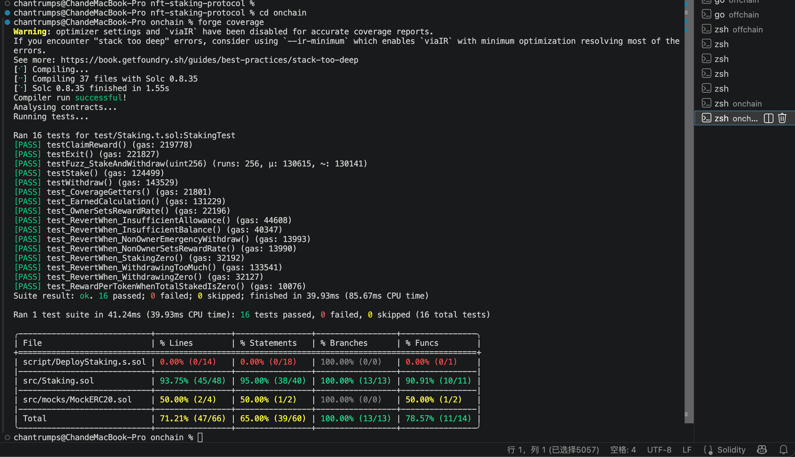
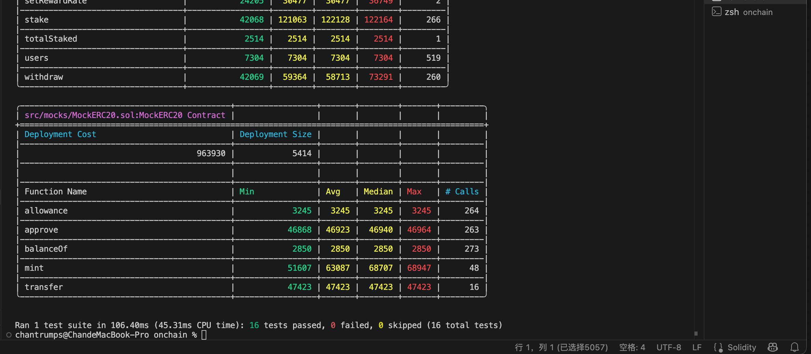

---

## 🚀 快速启动

### 方式 1：Docker Compose（推荐）

```bash
# 1. 启动全部服务
docker-compose up -d

# 2. 查看容器状态
docker-compose ps

# 3. 健康检查
curl http://localhost:8088/health
# {"status":"ok"}
```

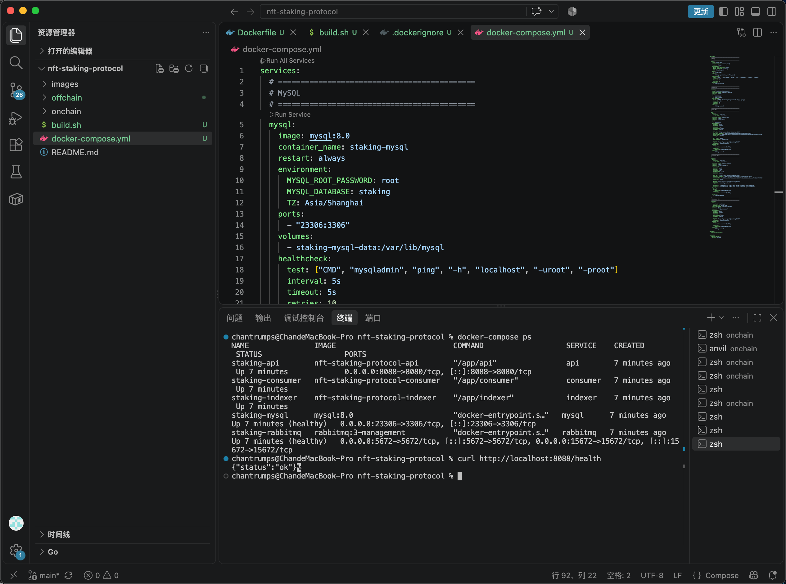

**服务端口：**

| 服务 | 宿主机端口 | 容器端口 |
| :--- | :--- | :--- |
| Anvil（外部，需单独启动） | 8545 | — |
| CEX API | 8088 | 8080 |
| MySQL | 23306 | 3306 |
| RabbitMQ | 5672 / 15672 | 5672 / 15672 |

> **说明：** Anvil 不包含在 docker-compose 中，需在宿主机单独启动。

### 方式 2：本地运行

```bash
# 1. 启动 anvil（本地链）
anvil --chain-id 31337 --host 0.0.0.0

# 2. 部署合约（新终端）
cd onchain
forge script script/DeployStaking.s.sol \
  --rpc-url http://127.0.0.1:8545 \
  --broadcast \
  --private-key 0xac0974bec39a17e36ba4a6b4d238ff944bacb478cbed5efcae784d7bf4f2ff80

# 3. 启动 MySQL + RabbitMQ（Docker）
docker run -d --name mysql -e MYSQL_ROOT_PASSWORD=root -p 3306:3306 mysql:8.0
docker run -d --name rabbitmq -p 5672:5672 -p 15672:15672 rabbitmq:3-management

# 4. 配置 .env
cp offchain/.env.example offchain/.env
# 按需修改 offchain/.env
```

**关于 .env 与 .env.example：**

- `offchain/.env.example` 是配置模板，已进 Git，供 clone 后参考
- `offchain/.env` 是实际配置，已在 `.gitignore` 中，不会进 Git
- 模板中的 `PRIVATE_KEY` 是 Anvil 默认账户 #0 的公开测试私钥，仅供本地开发，切勿用于生产环境

```bash
# 5. 启动服务（分别开 3 个终端）
cd offchain
go run cmd/api/main.go
go run cmd/indexer/main.go
go run cmd/consumer/main.go
```

---

## 📡 API 接口

| 方法 | 路径 | 用途 |
| :--- | :--- | :--- |
| GET | `/health` | 健康检查 |
| GET | `/api/v1/stake/:address` | 查询质押信息 |
| GET | `/api/v1/stake/:address/claims` | 查询领取历史 |
| POST | `/api/v1/stake` | 质押 |
| POST | `/api/v1/withdraw` | 提现 |
| POST | `/api/v1/claim` | 领取奖励 |

**示例：查询质押信息**

```bash
curl http://localhost:8088/api/v1/stake/0xf39Fd6e51aad88F6F4ce6aB8827279cffFb92266
```

**响应：**

```json
{
  "address": "0xf39Fd6e51aad88F6F4ce6aB8827279cffFb92266",
  "amount": "1000000000000000000000",
  "staked_at": 1784900120
}
```

**示例：查询领取历史**

```bash
curl http://localhost:8088/api/v1/stake/0xf39Fd6e51aad88F6F4ce6aB8827279cffFb92266/claims
```

**示例：质押**

```bash
curl -X POST http://localhost:8088/api/v1/stake \
  -H "Content-Type: application/json" \
  -d '{"amount": "100000000000000000000"}'
```

---

## 🧪 测试

### 一键跑全部测试

```bash
chmod +x offchain/test/run_all_tests.sh
./offchain/test/run_all_tests.sh
```

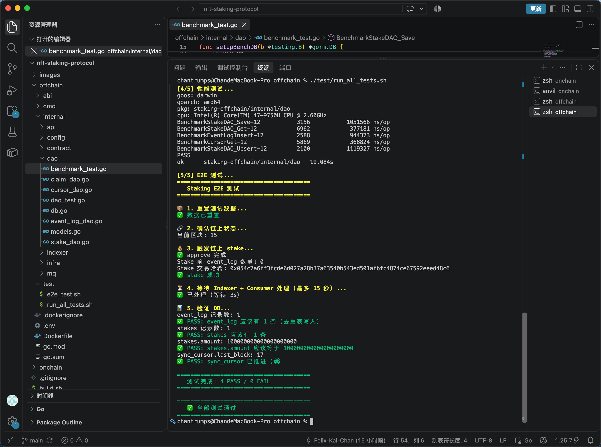

### 1. DAO 单元测试（5 PASS）

```bash
cd offchain
go test -v -count=1 ./internal/dao/ -run 'Test'
```

**测试内容：**

- `TestStakeDAO_SaveAndGet` — 保存 + 查询
- `TestStakeDAO_Upsert` — Upsert 不重复插入
- `TestEventLogDAO_Duplicate` — 去重表拦截重复
- `TestCursorDAO_GetAndUpdate` — Cursor 读写
- `TestClaimDAO_SaveAndGet` — Claim 保存 + 查询

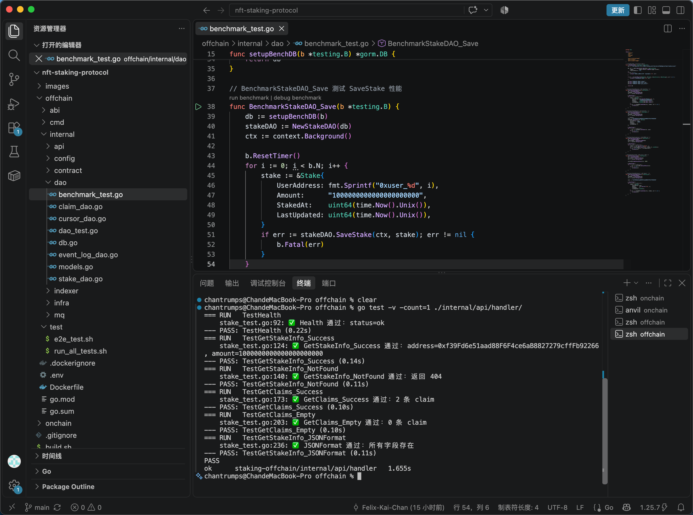

### 2. API Handler 测试（6 PASS）

```bash
go test -v -count=1 ./internal/api/handler/
```

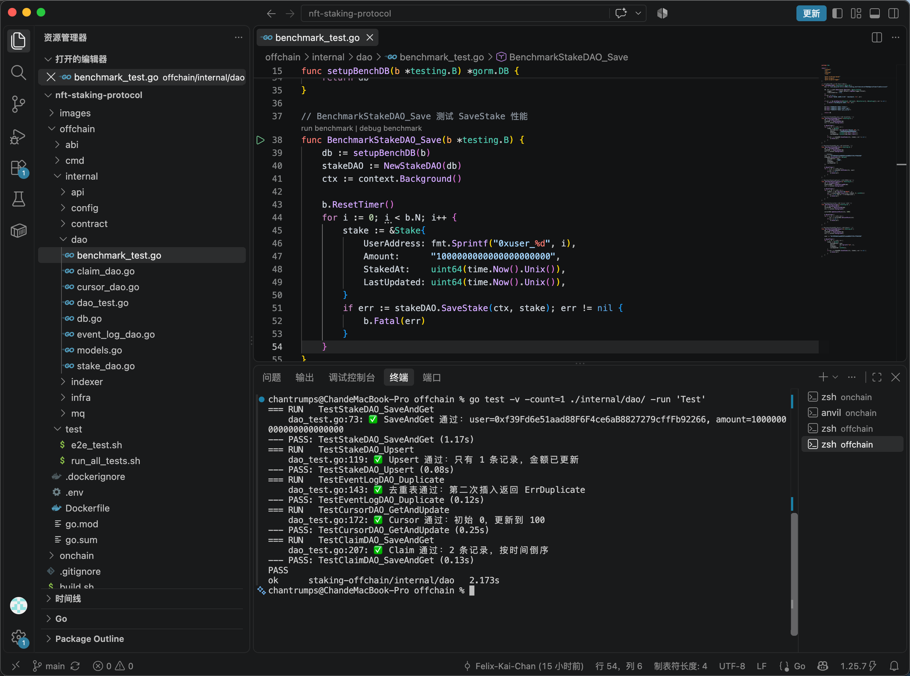

### 3. MQ 集成测试（4 PASS）

```bash
go test -v -count=1 ./internal/mq/
```

**关键验证：**

- Producer 投递消息
- Consumer 消费 + 写 DAO
- 重复消费被去重表拦截（幂等验证）
- Claimed 事件处理

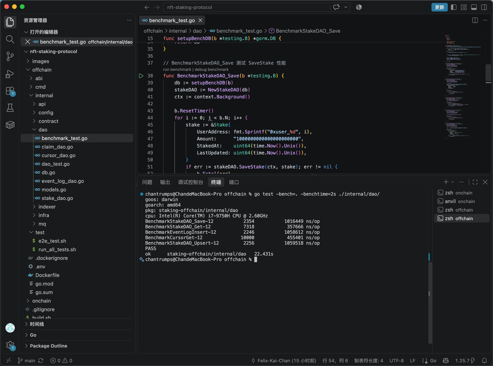

### 4. 性能测试（5 benchmark）

```bash
go test -bench=. -benchtime=2s ./internal/dao/
```

**结果：**

| Benchmark | ns/op |
| :--- | :--- |
| BenchmarkStakeDAO_Save | ~1.05 ms |
| BenchmarkStakeDAO_Get | ~0.37 ms |
| BenchmarkEventLogInsert | ~0.95 ms |
| BenchmarkCursorGet | ~0.37 ms |
| BenchmarkStakeDAO_Upsert | ~1.12 ms |

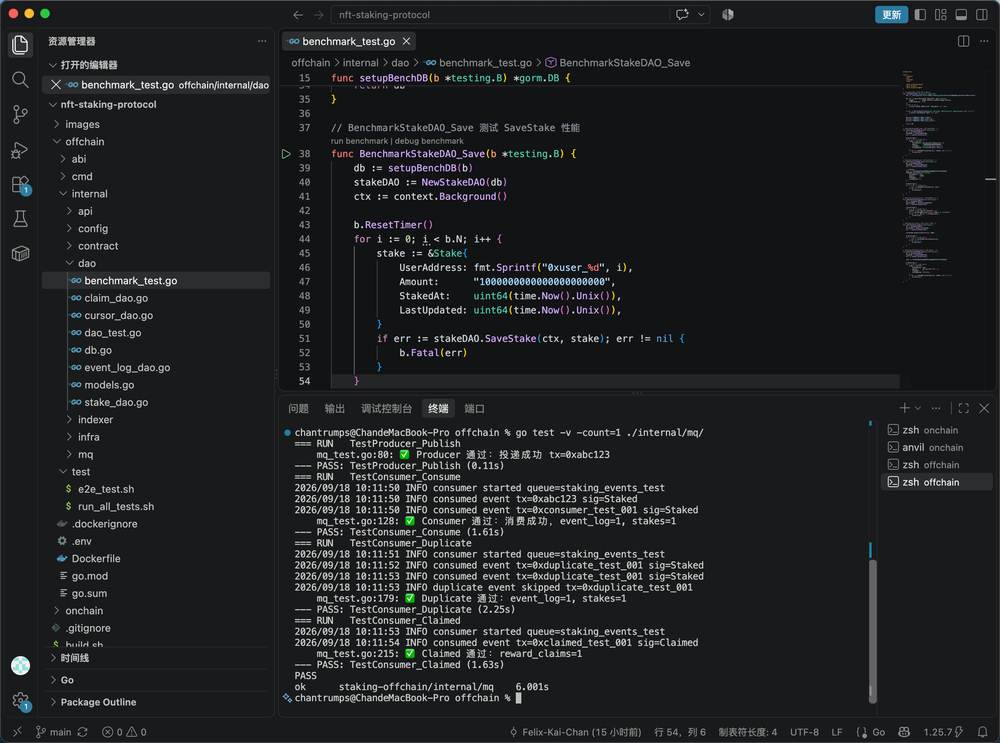

### 5. E2E 测试（4 PASS）

```bash
./offchain/test/e2e_test.sh
```

**测试流程：**

```text
① 清空 DB + 重置 Cursor
② 触发链上 stake 事件（cast）
③ 等待 Indexer 抓取 + 投递 MQ
④ 等待 Consumer 消费 + 写 DB
⑤ 查询 DB 验证：
   - event_log 有 1 条
   - stakes 有 1 条
   - sync_cursor 推进
```

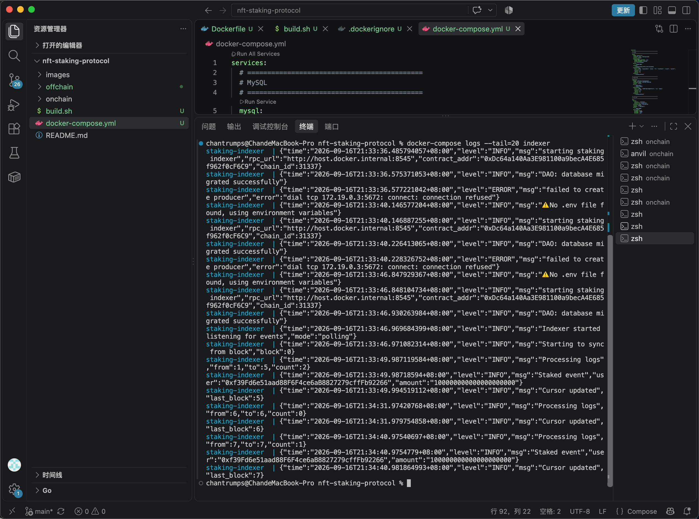
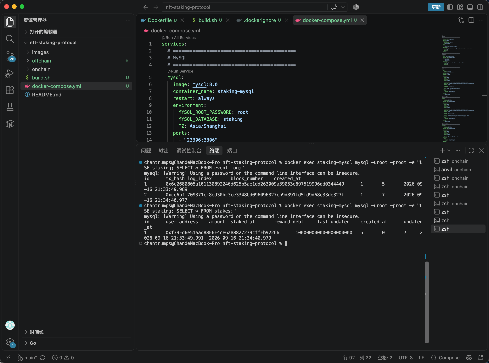

---

## 🐛 踩坑记录

### 坑 1：DAO 层缺失，Indexer 直接写 DB

- **现象：** 早期版本 Indexer 直接调用 GORM 写 MySQL，业务逻辑和数据访问耦合在一起。
- **问题：**
  - Indexer 和 API 都直接用 GORM，代码重复
  - 测试困难，无法独立测试数据访问层
  - 事务管理混乱
- **修复：** 抽离独立的 DAO 层（`internal/dao/`），6 个文件：
  - `db.go`：连接初始化 + AutoMigrate
  - `models.go`：4 张表定义
  - `stake_dao.go` / `claim_dao.go` / `cursor_dao.go` / `event_log_dao.go`
- **收益：**
  - 测试覆盖 DAO 层（5 个单元测试）
  - Indexer / Consumer / API 共用 DAO
  - 事务管理清晰

### 坑 2：同步任务和 API 请求耦合

- **现象：** 早期版本 Indexer 抓事件后直接写 DB，API 请求等待同步完成，用户响应慢。
- **问题：**
  - 同步失败 → 用户交易失败
  - 无法重试
  - 高并发下 DB 压力大
- **修复：** 引入 RabbitMQ：
  - `Indexer → MQ → Consumer → DAO → MySQL`
- **收益：**
  - 解耦同步任务和 API 请求
  - 同步失败自动重试
  - API 快速返回

### 坑 3：MQ 连接断开的处理

- **现象：** Indexer 跑 12 小时后，`failed to publish message: Exception (504) Reason: "channel/connection is not open"`
- **原因：** RabbitMQ 服务端连接超时断开，Indexer 没有重连机制。
- **当前解决：** 短期定时重启 Indexer。
- **后续规划：** 加 MQ 重连机制（监听 `NotifyClose` 事件，自动重连）。

### 坑 4：Docker 容器内访问宿主机 anvil 走代理

- **现象：** Indexer 日志报错：
  ```text
  Post "http://host.docker.internal:8545": proxyconnect tcp: dial tcp 127.0.0.1:7897: connect: connection refused
  ```
- **原因：**
  - Mac 上开着 Verge 系统代理（127.0.0.1:7897）
  - Docker 容器继承了 `HTTP_PROXY` / `HTTPS_PROXY` 环境变量
  - 容器内 127.0.0.1 是容器自己，不是宿主机
- **修复：** 在 docker-compose.yml 里加 NO_PROXY：
  ```yaml
  environment:
    NO_PROXY: "localhost,127.0.0.1,host.docker.internal,mysql,rabbitmq"
    no_proxy: "localhost,127.0.0.1,host.docker.internal,mysql,rabbitmq"
  ```

### 坑 5：Docker 构建时 go mod download 超时

- **现象：** docker-compose build 时：
  ```text
  proxyconnect tcp: dial tcp 127.0.0.1:7897: connect: connection refused
  ```
- **原因：** 容器内没有代理配置，访问 proxy.golang.org 超时。
- **修复：**
  - **方案 A：** 在 Dockerfile 里设 GOPROXY
    ```dockerfile
    ENV GOPROXY=https://goproxy.cn,direct
    ```
  - **方案 B：** 构建时传代理
    ```bash
    MAC_IP=$(ipconfig getifaddr en0)
    docker-compose build \
      --build-arg HTTP_PROXY=socks5://${MAC_IP}:7897 \
      --build-arg HTTPS_PROXY=socks5://${MAC_IP}:7897
    ```
  - 最终用方案 B（build.sh 自动获取局域网 IP）。

### 坑 6：onchain/lib/ 依赖库被提交

- **现象：** onchain/lib/ 里有几千个文件（OpenZeppelin + forge-std），被 Git 跟踪，仓库臃肿。
- **修复：**
  ```bash
  # 1. 加入 .gitignore
  echo "onchain/lib/" >> .gitignore
  echo "onchain/out/" >> .gitignore
  echo "onchain/cache/" >> .gitignore
  echo "onchain/broadcast/" >> .gitignore

  # 2. 从 Git 索引移除（本地文件保留）
  git rm -r --cached onchain/lib/
  ```
- **收益：**
  - 仓库体积减小
  - 通过 .gitmodules 管理依赖，clone 后 forge install 自动拉取

### 坑 7：.env 被提交到 Git

- **现象：** .env 里有私钥（PRIVATE_KEY=0x...），被 Git 跟踪，存在泄露风险。
- **修复：**
  ```bash
  git rm --cached offchain/.env
  echo "offchain/.env" >> .gitignore
  ```
- **关键：** 私钥等敏感信息绝对不能进 Git。
- **正确做法：**
  - `.env` → 真实配置，不进 Git
  - `.env.example` → 配置模板（含占位符或公开测试私钥），进 Git
  - README 指引：`cp .env.example .env`

### 坑 8：E2E 脚本查错 MySQL

- **现象：** E2E 脚本查本地 MySQL（3306），但 Docker 服务写的是 Docker MySQL（23306），E2E 一直失败。
- **原因：** 两个不同的数据库。
- **修复：** E2E 脚本改用 Docker MySQL：
  ```bash
  MYSQL_CMD="docker exec staking-mysql mysql -uroot -proot -e"
  MYSQL_DB="USE staking;"
  ```

### 坑 9：created_at 字段类型转换失败

- **现象：** SQL 用 int64 接收 MySQL 的 DATETIME 字段，报错：
  ```text
  Scan error on column index 5, name "created_at": converting driver.Value type time.Time to a int64
  ```
- **修复：** 类型改成 time.Time：
  ```go
  var orders []struct {
      CreatedAt time.Time  // 不是 int64
  }
  ```

### 坑 10：Indexer Cursor 一直不推进

- **现象：** Cursor 卡在 last_block = 2，永远不动。
- **原因：** 代码逻辑：
  ```go
  safeBlock := currentBlock
  if currentBlock > 12 {
      safeBlock = currentBlock - 12
  } else {
      continue  // ← 当前区块 ≤ 12，永远跳过
  }
  ```
- **修复：** 本地测试环境改成不等待确认：
  ```go
  safeBlock := currentBlock  // 本地测试不等待
  ```
- **建议配置化：** 用 CONFIRMATION_BLOCKS 环境变量控制，本地 0，生产 12：
  ```go
  confirmationBlocks := cfg.ConfirmationBlocks  // 本地 0，生产 12
  safeBlock := currentBlock - confirmationBlocks
  ```
- **生产环境：** 保留 `currentBlock - 12`（等待 12 个区块确认，防 Reorg）。

---

## 📋 后续规划

- [ ] MQ 重连机制 — 解决 Indexer 跑久后 MQ 连接断开问题
- [ ] Redis 缓存层 — 缓存热门用户质押信息
- [ ] Prometheus + Grafana 监控 — 监控 Indexer TPS / API QPS
- [x] GitHub Actions CI（合约层） — 自动化测试（onchain/.github/workflows/test.yml）
- [ ] GitHub Actions CI/CD（后端） — 后端测试 + 自动部署
- [ ] 多链支持 — 支持 Ethereum / Polygon / Arbitrum
- [ ] Kubernetes 部署 — 生产级容器编排
- [ ] 前端 DApp 集成 — React + ethers.js
- [ ] 合约升级机制 — 使用 UUPS 代理模式

---

## 👤 作者

Web3 后端工程实践项目。

关注领域：

- 智能合约开发（Solidity + Foundry）
- 区块链事件索引（Polling + Cursor + 幂等）
- 消息队列解耦（RabbitMQ）
- 后端架构（Go + Gin + GORM + DAO 分层）
- 容器化部署（Docker Compose）

---

## 📄 License

MIT License
